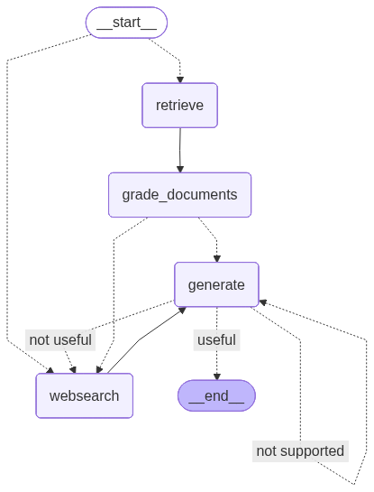

# Agentic RAG

> A LangGraph-based agentic retrieval-augmented generation pipeline with intelligent routing, document relevance grading, hallucination detection, and answer quality validation.

   

---

## Overview

This project implements a **Self-RAG + Adaptive RAG** pattern using LangGraph. Instead of naively retrieving documents and generating an answer, the pipeline:

1. **Routes** the question — decides whether to search a curated vector store or fall back to live web search
2. **Grades** retrieved documents for relevance — filters out noise before generating
3. **Generates** a concise answer using Claude Haiku with the filtered context
4. **Validates** the answer in two stages — checks for hallucinations and whether the answer actually resolves the question, looping back if either check fails

The result is a pipeline that produces reliable, grounded answers and self-corrects when it can't.

---

## Architecture



### Graph Flow

```
Question
   │
   ▼
[route_question] ──────────────────────────────────┐
   │ vectorstore topic                              │ other topic
   ▼                                               ▼
[retrieve]                                    [websearch]
   │                                               │
   ▼                                               │
[grade_documents]                                  │
   │ all relevant                                  │
   ├──────────────────────────────────────────────►│
   │ some irrelevant (web_search=True)             │
   │                                               │
   ▼                                               ▼
[decide_to_generate] ──── web_search=True ──► [websearch]
   │ web_search=False                              │
   └───────────────────────────────────────────────┘
                                                   │
                                                   ▼
                                             [generate]
                                                   │
                                                   ▼
                                  [grade_generation_v_docs_and_question]
                                       │            │            │
                                  hallucinated  not useful    useful
                                       │            │            │
                                       ▼            ▼            ▼
                                  [generate]  [websearch]      END
```

### Nodes

| Node | Description |
|---|---|
| `route_question` | Routes query to vectorstore (agents/prompts/attacks topics) or web search |
| `retrieve` | Fetches relevant documents from Chroma vector store using semantic search |
| `grade_documents` | Scores each document for relevance; sets `web_search=True` if any are irrelevant |
| `generate` | Produces a concise 3-sentence answer using Claude Haiku + retrieved context |
| `websearch` | Falls back to Tavily web search (top 2 results) and appends them as documents |

---

## Key Design Decisions

**Adaptive RAG** — The router chain uses Claude Haiku with structured output to classify the question topic before any retrieval happens. Questions about agents, prompt engineering, or adversarial attacks go to the curated vector store; everything else hits live web search. This avoids polluting retrieval with out-of-domain queries.

**Self-RAG** — After generation, two independent graders validate the output:
- *Hallucination grader*: checks if the answer is grounded in the retrieved documents
- *Answer grader*: checks if the answer actually resolves the original question

If either fails, the graph loops back — either retrying generation or triggering a web search for better context.

**Type-safe grading** — All graders use `.with_structured_output()` binding with Pydantic models (`GradeDocuments`, `GradeHallucinations`, `GradeAnswer`). This makes LLM decisions strongly typed binary values rather than free-text strings to parse.

---

## Project Structure

```
.
├── main.py               # Entry point — invokes graph with a sample question
├── ingestion.py          # One-time data ingestion into Chroma vector store
├── graph/
│   ├── graph.py          # LangGraph StateGraph definition with all edges and routing
│   ├── state.py          # GraphState Pydantic model
│   ├── consts.py         # Node name constants
│   ├── nodes/            # Node functions: retrieve, grade_documents, generate, web_search
│   └── chains/           # LangChain chains: router, generation, all graders
│       └── tests/        # pytest tests for all chains
└── graph.png             # Auto-generated graph visualization
```

---

## Setup

### Prerequisites

- Python 3.12+
- [UV](https://github.com/astral-sh/uv) package manager
- API keys for Anthropic, Voyage AI, and Tavily

### 1. Clone and install

```bash
git clone <repo-url>
cd "Agentic RAG"
uv sync
```

### 2. Configure environment

Create a `.env` file in the project root:

```env
ANTHROPIC_API_KEY=your_key_here
VOYAGE_API_KEY=your_key_here
TAVILY_API_KEY=your_key_here

# Optional: LangSmith tracing
LANGSMITH_API_KEY=your_key_here
LANGSMITH_PROJECT=agentic-rag
LANGSMITH_TRACING=true
```

### 3. Ingest documents (one-time)

Loads and embeds documents from Lilian Weng's blog posts on prompt engineering and adversarial attacks into a local Chroma vector store:

```bash
python ingestion.py
```

### 4. Run

```bash
python main.py
```

### 5. Test

```bash
pytest graph/chains/tests/test_chains.py -v
```

---

## Tech Stack

| Component | Technology |
|---|---|
| LLM | Claude Haiku (Anthropic) |
| Agentic Orchestration | LangGraph |
| LLM Framework | LangChain |
| Vector Store | Chroma (local persistence) |
| Embeddings | Voyage AI (`voyage-4-lite`) |
| Web Search | Tavily |
| Data Validation | Pydantic v2 |
| Package Manager | UV |

---

## Environment Variables

| Variable | Required | Description |
|---|---|---|
| `ANTHROPIC_API_KEY` | Yes | Claude Haiku API access |
| `VOYAGE_API_KEY` | Yes | Voyage AI embeddings for vector store |
| `TAVILY_API_KEY` | Yes | Web search fallback |
| `LANGSMITH_API_KEY` | No | LangSmith tracing and debugging |
| `LANGSMITH_PROJECT` | No | LangSmith project name |
| `LANGSMITH_TRACING` | No | Set to `true` to enable trace logging |
